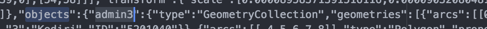
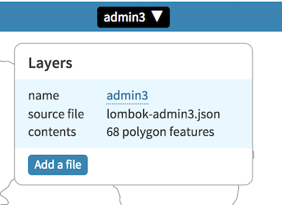
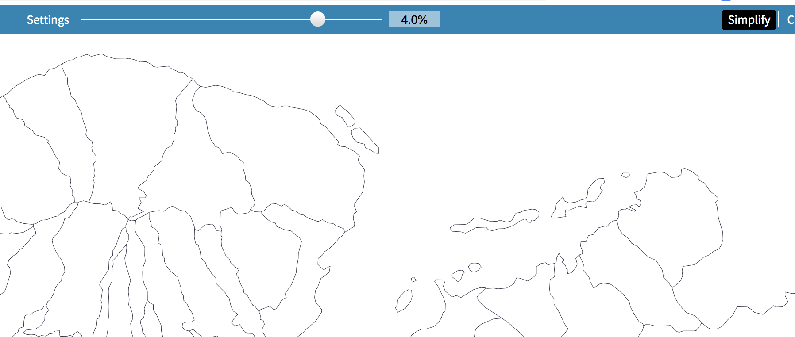

### 2018-idn-earthquakes-maps

## Embedding

- an iframe embed will require 406px (350 for the map row and 56 for the title row) for each "sector" map

## Development

- The `data/*.json` files are TopoJSON (generally makes for **much** smaller file size) 
- I suggest you use [mapshaper](https://mapshaper.org/)
  - Import your file
  - Set the layer name to the value you set in the map's index.html (`var topojsonObjectsGroup = 'admin3';`)
  - 
  - Use the "Simplify" command with "prevent shape removal" turned on in the settings (you may be able to go as low as 3-4% and still have enough detail for your purposes)
  - Export as TopoJSON 

  
## Testing

You can test the website using Python's [SimpleHTTPServer](https://www.pythonforbeginners.com/modules-in-python/how-to-use-simplehttpserver/) or Node [http-server](https://www.npmjs.com/package/http-server).
  